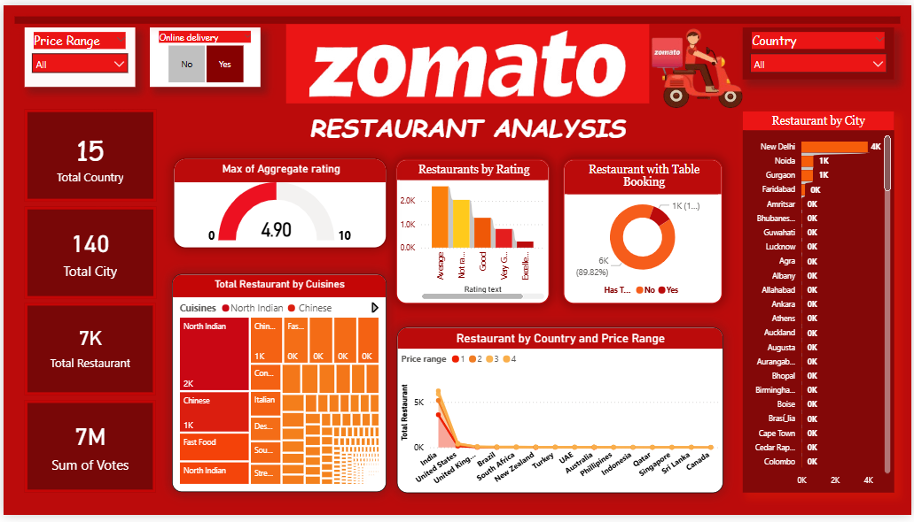

# 🍴 Zomato Data Analysis & Dashboard

## 📌 Project Overview
This project explores the Zomato restaurant dataset with **EDA in Python (Jupyter Notebook)** and builds an **interactive dashboard in Power BI** for insights on cuisines, ratings, delivery options, and restaurant trends.

## 📂 Files in this Repository
- `Zomato_Cleaned.csv` → Cleaned dataset after preprocessing  
- `Zomato_EDA.ipynb` → Jupyter Notebook with data cleaning & EDA  
- `Zomato_Dashboard.pbix` → Power BI interactive dashboard  
- `README.md` → Project documentation  

## 🔍 Key Insights
- Popular cuisines across different countries  
- Distribution of restaurants by city and price range  
- Online delivery vs. dine-in comparison  
- Restaurant ratings and customer votes  

## 🚀 Tools Used
- **Python (Pandas, Matplotlib, Seaborn)** → Data Cleaning & EDA  
- **Power BI** → Dashboard Visualization  
- **GitHub** → Version control & sharing
- **Jupyter Notebook** 

## 📊 Dashboard Preview

